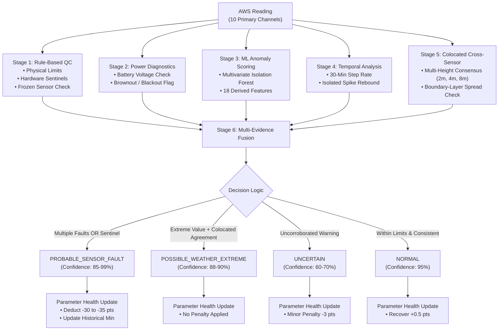

# WeatherTrust: Explainable AWS Anomaly Detection & Dynamic Reliability Platform

> **Smart India Hackathon 2026** | **Problem Statement SIH26073:** AI/ML-Based Intelligent Anomaly Detection for Automatic Weather Stations (AWS)  
> **Nodal Agency / Organization:** Space Applications Centre (SAC), Indian Space Research Organisation (ISRO)  
> **Team:** NovaForge  
> **Scientific Disclosure:** *“Exploratory anomalies are real observations; final fault labels require validation.”*

---

## Project at a Glance (1-Minute Executive Summary)

| Dimension | Project Specification |
|:---|:---|
| **What WeatherTrust Does** | An explainable quality-control and anomaly detection platform for Automatic Weather Stations (AWS) that distinguishes genuine regional meteorological extremes from electronic sensor faults and tracks dynamic parameter-level reliability. |
| **The Core Problem** | In regions like Gujarat, pre-monsoon heatwaves regularly reach 45°C–50°C. Conventional static thresholds reject genuine extremes as sensor faults, while off-the-shelf ML models generate high false alarms by flagging rare weather as hardware errors. |
| **Our Key Innovation** | **Multi-Source Evidence Fusion:** Combines deterministic physical bounds, colocated multi-height tower consensus (2m, 4m, 8m), temporal spike-rebound tests, power diagnostics, and Isolation Forest ML scoring into an explainable classification. |
| **Key Differentiator** | **Parameter-Level Dynamic Reliability:** Tracks health (0–100) independently per sensor channel over time (recovering after clean periods, preserving historical minimums) rather than discarding an entire station. |
| **Working MVP Status** | **Fully Operational MVP:** Python detection engine (`analysis/`) + interactive Next.js 14 / TypeScript / Recharts dashboard (`app/`) operating on real historical telemetry. |
| **Dataset Evaluated** | Real historical AWS data obtained from **MOSDAC, Space Applications Centre (SAC), ISRO** (`AGROMET04_15F105`, Junagadh Agricultural University, Gujarat). |
| **Dataset Scale** | **14,706 observations** (30-min intervals) spanning 14 months (Jan 2016 – Mar 2017) $\rightarrow$ **147,060 sensor evaluations** across 10 monitored channels. |
| **Classification Results** | **98.83% Verified Normal** (145,343), **0.02% Probable Sensor Faults** (30), **0.09% Possible Weather Extremes** (129), **1.06% Uncertain Warnings** (1,558). |

---

## 1. WeatherTrust — One-Line Description

An explainable multi-evidence quality-control and anomaly detection platform for Automatic Weather Stations (AWS) that distinguishes genuine regional meteorological extremes from electronic sensor faults and tracks dynamic, parameter-level sensor reliability.

---

## 2. Problem Statement

Automatic Weather Stations (AWS) operate unattended in harsh and remote environments, making them prone to hardware faults such as analog-to-digital converter (ADC) glitches, sensor drift, open circuits, line noise, and battery brownouts. At the same time, climate change has made extreme meteorological events (heatwaves, cloudbursts, severe microbursts) more frequent and intense.

Distinguishing genuine weather extremes from faulty sensor readings is difficult because:
- **Numerical Extremity Does Not Equal Failure:** In arid or semi-arid regions such as Gujarat, surface temperatures regularly exceed 45°C to 50°C during pre-monsoon heatwaves. A simple threshold rule (e.g., flagging temperatures above 45°C as sensor errors) rejects genuine climatological events critical for disaster management and climate modeling.
- **Isolated Electronic Glitches Resemble Flash Phenomena:** An ADC transient can produce a sudden jump (e.g., plunging from 32°C to -33.4°C for a single 30-minute interval and immediately returning to normal). Looking at numerical range alone cannot reliably determine whether this is an extreme cold-air pocket or a hardware fault without inspecting temporal rates and surrounding sensors.
- **Unsupervised ML Alone Produces False Alarms:** Off-the-shelf anomaly detectors (such as Isolation Forest or autoencoders) flag any rare multivariate pattern as an outlier. If used as the sole arbiter, they routinely misclassify real atmospheric extremes as hardware malfunctions.

---

## 3. Our Solution

WeatherTrust replaces blunt thresholding and black-box ML with **multi-source evidence fusion**. Instead of evaluating a sensor reading in isolation, WeatherTrust examines five independent lines of evidence:
1. **Physical Domain Limits & Hardware Sentinels:** Checks physical possibility boundaries and known unread-bus or open-circuit sentinel signatures (e.g., 0.0 mbar pressure, 0.0V battery, -40.0°C thermistor disconnects).
2. **Colocated Multi-Height Cross-Sensor Consensus:** On towers equipped with multi-height sensors (e.g., 2m, 4m, 8m air temperature and relative humidity), genuine weather changes are confirmed when adjacent vertical levels agree within natural boundary-layer gradients. An isolated divergence on one channel indicates probable sensor failure.
3. **Temporal Step-Rate & Isolated Spike Rebound:** Evaluates 30-minute rate-of-change and tests for isolated transient spikes (a violent jump followed by an immediate opposite rebound to baseline).
4. **Power & Diagnostic Telemetry Corroboration:** Cross-references station battery voltage to identify brownout or blackout events that corrupt analog sensor channels.
5. **Multivariate ML Outlier Scoring:** Uses a reproducible Multivariate Isolation Forest as a secondary anomaly scoring signal rather than an uncorroborated single judge.

Every observation is classified into one of four discrete, explainable categories:
- `NORMAL`: Verified observation consistent across physical, cross-sensor, and temporal checks.
- `PROBABLE_SENSOR_FAULT`: Multiple independent fault signals or hardware sentinels indicate probable sensor malfunction.
- `POSSIBLE_WEATHER_EXTREME`: Observation is climatologically extreme, but colocated towers and temporal continuity support genuine atmospheric phenomena.
- `UNCERTAIN`: Isolated warning or mild divergence that warrants monitoring without prematurely discarding data.

> [!NOTE]  
> **Scientific Transparency Disclosure:** The observations analyzed are real historical records from MOSDAC, Space Applications Centre (SAC), ISRO. In the absence of external hardware maintenance logs for this specific station period, classifications (`PROBABLE_SENSOR_FAULT`, `POSSIBLE_WEATHER_EXTREME`) represent WeatherTrust's algorithmic determinations based on multi-sensor evidence fusion. *Exploratory anomalies are real observations; final fault labels require validation.*

---

## 4. Key Features

The following features are implemented in the current MVP:

- **Deterministic Rule-Based QC:** Centralized physical bounds for 10 primary parameters (`analysis/config.py`), missing-data handling across 127 data gaps, hardware sentinel identification (0.0 mbar, 0.0V, 73,730+ mm rain gauge overflows), and frozen/stuck sensor detection (flagging 12+ consecutive static readings while excluding natural saturation points like 100% RH during precipitation).
- **Colocated Cross-Sensor Consensus Verification:** Multi-height consensus logic for 2m, 4m, and 8m temperature and relative humidity. Identifies the closest agreeing pair to establish the boundary-layer consensus median, then computes the deviation of the remaining sensor.
- **Temporal Spike & Rebound Detection:** Calculates 30-minute rates of change, rolling median, and median absolute deviation (MAD). Flags isolated single-step glitches where an extreme departure is immediately followed by a return to baseline.
- **Power Diagnostic Corroboration:** Directly evaluates battery voltage (`BATTRY_VOLTAGE(V)`) to correlate sensor dropouts with power brownouts (<10.5V) or total battery failure (<=0.5V).
- **Multivariate ML Anomaly Scoring:** Scikit-learn Isolation Forest (`n_estimators=100`, `contamination=0.01`, `random_state=42`) trained on 18 features (raw telemetry, multi-height vertical differences, and 30-minute rate-of-change features).
- **Explainable Classification & Deterministic Confidence:** Multi-evidence fusion logic that synthesizes rule flags, consensus status, temporal metrics, power diagnostics, and ML scores into a deterministic confidence score (0.0 to 1.0) and an audit-ready, plain-English explanation.
- **Parameter-Level Dynamic Reliability Engine:** Stateful trust score engine tracking health scores (0–100) per individual sensor parameter over time, featuring fault penalties, clean-data recovery, historical minimum tracking, and a 30-day rolling reliability score.
- **Full-Featured Interactive Web Dashboard:** Desktop-first Next.js 14 / TypeScript / Tailwind CSS / Recharts interface with time-series explorer, filterable event tables, dynamic health trajectories, and an interactive event explanation drawer.

---

## 5. How WeatherTrust Works

WeatherTrust executes a sequential, 6-stage detection pipeline for every incoming telemetry observation:



### Pipeline Decision Logic

| Condition | Assigned Classification | Confidence | Health Score Impact |
|:---|:---|:---:|:---:|
| Hardware sentinel detected (e.g. 0.0 mbar, 0.0V) | `PROBABLE_SENSOR_FAULT` | 99% | -35 points |
| Severe cross-sensor conflict AND isolated temporal spike | `PROBABLE_SENSOR_FAULT` | 98% | -30 points |
| Severe cross-sensor conflict during power failure | `PROBABLE_SENSOR_FAULT` | 97% | -30 points |
| $\ge 2$ independent fault signals agreeing | `PROBABLE_SENSOR_FAULT` | 85%–99% | -30 points |
| Frozen reading ($\ge 12$ consecutive steps, excluding 100% RH) | `PROBABLE_SENSOR_FAULT` | 90% | -30 points |
| Extreme value ($\ge 43^\circ\text{C}$ or $\le 8^\circ\text{C}$), but colocated sensors agree & temporal change is continuous | `POSSIBLE_WEATHER_EXTREME` | 88%–90% | 0 (no penalty) |
| Isolated warning or ML outlier without corroborating physical fault | `UNCERTAIN` | 60%–70% | -3 points |
| Normal range, consistent across colocated channels | `NORMAL` | 95% | +0.5 points (recovery) |

---

## 6. Working MVP

### Currently Implemented (In Repository)
- [x] **Data Ingestion & Preprocessing:** Handles 14,706 alternating blank-line records from MOSDAC, parses IST timestamps, identifies 127 data gaps, normalizes schemas, and preserves raw values.
- [x] **Deterministic Quality Control:** Physical domain checks, sentinel detection, stuck sensor checks, and battery diagnostics.
- [x] **Multi-Height Consensus Engine:** Pairwise and 3-sensor median consensus algorithms for 2m, 4m, and 8m temperature and humidity.
- [x] **Temporal Glitch Detector:** Jump-and-rebound detection across 30-minute intervals.
- [x] **Multivariate Isolation Forest:** Feature engineering (levels, vertical differences, step rates) with fixed seed (`random_state=42`).
- [x] **Explainable Classifier:** Evidence aggregation with plain-English explanation generation.
- [x] **Dynamic Health Engine:** Per-parameter health tracking (0–100), historical minimum tracking, and 30-day rolling reliability calculation.
- [x] **Validation Suite:** Automated test scripts (`validate_phase1.py`) validating known validation events and sanity checks.
- [x] **Web Dashboard (Next.js 14):** 5 interactive workspace tabs (Overview, Telemetry, Events, Sensor Health, Methodology) and drill-down explanation modal.

### Planned Work (Roadmap / Not Yet Implemented)
- [ ] **Multi-Station Spatial Neighbour Consensus:** Cross-station Kriging or Inverse Distance Weighting across surrounding geographical AWS stations.
- [ ] **Live Telemetry Feed Ingestion:** Extend the pipeline from historical files to live AWS telemetry feeds/APIs where available.
- [ ] **Streaming Inference Service:** Dedicated service (e.g., using FastAPI / Kafka) capable of scoring sub-second incoming telemetry packets.
- [ ] **Persistent Time-Series Database:** PostgreSQL with TimescaleDB extension.
- [ ] **Automated Alert Dispatch:** SMS, Email, and Webhook dispatching for meteorologists and field teams.
- [ ] **Automated Work-Order Generation:** Direct generation of field repair tickets for degraded sensors.

---

## 7. Dataset

The pipeline operates on real Automatic Weather Station historical telemetry:

- **Dataset Source:** MOSDAC, Space Applications Centre (SAC), ISRO (`data/mosdac_gujarat.csv`)
- **Station ID:** `AGROMET04_15F105`
- **Station Location:** Junagadh Agricultural University, Junagadh, Gujarat, India
- **Coordinates:** Latitude 21.499166°N, Longitude 70.443340°E (Altitude not recorded in source)
- **Observation Period:** 1 January 2016 05:30 IST to 2 March 2017 05:00 IST (14 months)
- **Observation Count:** 14,706 records (nominal interval: 30 minutes)
- **Data Gaps:** 127 timestamp gaps (> 60 minutes); maximum continuous gap is 1,708.5 hours.
- **Sensor Evaluations:** 147,060 total sensor evaluations across 10 monitored parameters.

### Channels Monitored by the Engine

| Channel Canonical Name | Source CSV Column Header | Units | Monitoring Role |
|:---|:---|:---:|:---|
| `temp_2m` | `AIR_TEMPERATURE1(°C at 2m height)` | °C | Primary / Consensus |
| `temp_4m` | `AIR_TEMPERATURE2(°C at 4m height)` | °C | Primary / Consensus |
| `temp_8m` | `AIR_TEMPERATURE3(°C at 8m height)` | °C | Primary / Consensus |
| `rh_2m` | `RELATIVE_HUMIDITY1(% at 2m height)` | % | Primary / Consensus |
| `rh_4m` | `RELATIVE_HUMIDITY2(% at 4m height)` | % | Primary / Consensus |
| `rh_8m` | `RELATIVE_HUMIDITY3(% at 8m height)` | % | Primary / Consensus |
| `pressure` | `ATMOSPHERIC_PRESSURE(mbar)` | mbar | Surface Primary |
| `battery_voltage` | `BATTRY_VOLTAGE(V)` | V | Diagnostic / Power |
| `wind_speed_10m` | `WIND_SPEED3(m/s at 10m height)` | m/s | Primary Surface |
| `rainfall` | `RAINFALL(mm)` | mm | Primary Precipitation |

*Additional channels present in the raw CSV (wind speed at 3m/6m, wind direction at 3m/6m/10m, soil temperatures and moistures at 3 depths, shortwave/longwave radiation, soil heat flux) are parsed during ingestion.*

---

## 8. Example Anomalies Identified in the Dataset

Out of 147,060 total sensor evaluations across the 14-month dataset:
- **Verified Normal:** 145,343 (98.83%)
- **Probable Sensor Faults:** 30 (0.02%)
- **Possible Weather Extremes:** 129 (0.09%)
- **Uncertain Warnings:** 1,558 (1.06%)

Below are concrete anomalies identified by WeatherTrust from the real historical observations. Each example clearly delineates: **observed measurement $\rightarrow$ algorithmic evidence $\rightarrow$ classification $\rightarrow$ interpretation**:

### 1. Probable Sensor Fault: −33.4°C Transient Reading (4m Tower)
- **Observed Measurement:** At 19 March 2016 11:30 IST, `temp_4m` reported **-33.4°C** (a step change of **-65.4°C** from 32.0°C at 11:00 IST).
- **Algorithmic Evidence:** Colocated sensors remained normal (`temp_2m` = **35.15°C**, `temp_8m` = **36.85°C**, spread 1.7°C, consensus mean = 36.0°C; cross-sensor divergence = **69.4°C**). At 12:00 IST, `temp_4m` rebounded by **+68.1°C** to **34.7°C** (net baseline shift only 2.7°C).
- **WeatherTrust Classification:** `PROBABLE_SENSOR_FAULT` (Confidence: **99.0%**).
- **Interpretation:** Incompatible with natural boundary-layer thermodynamics; strongly indicative of an isolated transducer or ADC glitch rather than atmospheric sub-zero temperatures in tropical Gujarat.
- **Algorithmic Independence:** Even if the -5.0°C physical lower bound rule is completely disabled, the combination of cross-sensor consensus conflict (69.4°C) and temporal jump-rebound triggers `PROBABLE_SENSOR_FAULT` at 98% confidence.

### 2. Correlated Power/Telemetry Failure Event (September 2016)
- **Observed Measurement:** From 21 September 2016 02:00 to 06:00 IST, `battery_voltage` dropped to **0.0 V**, and `pressure` collapsed to **0.0 mbar** (normal: ~1000 mbar). At 05:30 IST, all multi-height temperature and relative humidity sensors also read **0.0**.
- **Algorithmic Evidence:** Simultaneous collapse across independent physical sensors coinciding exactly with 0.0V battery voltage; Isolation Forest anomaly score reached **1.000** (maximum theoretical outlier).
- **WeatherTrust Classification:** `PROBABLE_SENSOR_FAULT` (Confidence: **99.0%**) across affected channels.
- **Interpretation:** Electrical power dropout / battery depletion resulting in unpowered transducer buses, rather than an extreme atmospheric pressure vacuum. System resumed regular readings at 09:30 IST as battery voltage climbed back to 13.4V.

### 3. Implausible Rainfall Sensor Readings
- **Observed Measurement:**
  - 14 January 2016 00:30 IST: `rainfall` = **73,730.0 mm**
  - 7 December 2016 22:30 IST: `rainfall` = **81,094.0 mm**
  - 24 February 2017 22:30 IST: `rainfall` = **353,280.0 mm**
- **Algorithmic Evidence:** Values exceed the regional annual physical maximum limit (3,000 mm) by orders of magnitude in a single 30-minute interval.
- **WeatherTrust Classification:** `PROBABLE_SENSOR_FAULT` (Confidence: **99.0%**).
- **Interpretation:** Tipping-bucket pulse counter overflow or digital register corruptions rather than physical rainfall.

### 4. Severe Isolated Relative Humidity Drop
- **Observed Measurement:** At 3 June 2016 03:00 IST, `rh_8m` dropped to **27.6%**.
- **Algorithmic Evidence:** Colocated `rh_2m` was **80.8%** and `rh_4m` was **80.9%** (consensus divergence > **53%**).
- **WeatherTrust Classification:** `PROBABLE_SENSOR_FAULT` (Confidence: **98.0%**).
- **Interpretation:** Isolated sensor malfunction at the 8m level while lower tower levels maintained consistent ambient humidity.

### 5. Legitimate Pre-Monsoon Extreme Heatwave Preserved
- **Observed Measurement:** 28 April 2016 16:30 IST (`temp_8m` = **50.2°C**) and 18 May 2016 14:30 IST (`temp_8m` = **50.0°C**, `temp_2m` = **46.1°C**, `temp_4m` = **45.3°C**).
- **Algorithmic Evidence:** Vertical tower gradient is physically coherent (spread $\le 2.3^\circ\text{C}$ between towers) and 30-minute temporal step change is continuous (+0.5°C to +1.2°C) matching afternoon solar irradiance.
- **WeatherTrust Classification:** `POSSIBLE_WEATHER_EXTREME` (Confidence: **90.0%**).
- **Interpretation:** Genuine regional heatwave; correctly preserved without penalizing sensor health.

---

## 9. Parameter-Level Dynamic Reliability

A key differentiating feature of WeatherTrust is its **parameter-level dynamic reliability engine**:

```
Traditional AWS Monitoring:          WeatherTrust Parameter-Level Dynamic Monitoring:
┌───────────────────────────────┐    ┌────────────────────────────────────────────────────────┐
│ Station AGROMET04_15F105:     │    │ temp_2m:          Health 100/100 (30d Rel: 98.8%)  OK  │
│ [ X ] STATION ERROR           │    │ temp_4m:          Health  62/100 (Fault at 11:30)  WARN│
│                               │    │ temp_8m:          Health 100/100 (30d Rel: 99.4%)  OK  │
│ (One sensor fails, discarding │    │ pressure:         Health 100/100 (30d Rel: 99.4%)  OK  │
│ or distrusting the entire     │    │ battery_voltage:  Health 100/100 (30d Rel: 98.7%)  OK  │
│ station's telemetry)          │    │ wind_speed_10m:   Health 100/100 (30d Rel: 99.4%)  OK  │
└───────────────────────────────┘    └────────────────────────────────────────────────────────┘
```

### Why This Matters
1. **No Station-Wide Discarding:** An Automatic Weather Station carries 10+ independent transducers. If the 4m temperature sensor experiences an electronic transient, the 2m temperature, barometric pressure, solar radiation, and wind sensors remain scientifically sound.
2. **Transient Failures Do Not Mark a Sensor as Dead Forever:** A transient glitch does not mean a sensor must be permanently condemned. If a sensor operates cleanly for weeks following an isolated glitch, its operational health gradually recovers.
3. **Historical Minimum Preserves Degradation History:** While current health recovers during good periods, WeatherTrust tracks `minimum_health` to retain an indelible record of past severe failures for maintenance auditing.

### Mathematical Formulation

#### 1. Dynamic Health Trajectory ($H_{s, t} \in [0, 100]$)
For sensor $s$ at time step $t$:
$$H_{s, t} = \max\left(0, \min\left(100, H_{s, t-1} + \Delta H\right)\right)$$
Where the score delta $\Delta H$ is governed by centralized configuration (`analysis/config.py`):
$$\Delta H = \begin{cases} -35.0 & \text{if Hardware Sentinel Fault} \\ -30.0 & \text{if Confirmed Probable Sensor Fault} \\ -3.0 & \text{if Uncertain Warning} \\ -0.2 & \text{if Observation is Missing} \\ +0.5 & \text{if Verified Normal Reading (Recovery Credit)} \\ 0.0 & \text{if Possible Weather Extreme (No Penalty)} \end{cases}$$

#### 2. Recent 30-Day Windowed Reliability ($\text{Rel}_{30\text{d}}$)
Calculated strictly from observations within the final 30 calendar days of telemetry:
$$\text{Rel}_{30\text{d}} = 100 \times \left[1 - \frac{\text{Faults} \times 1.0 + \text{Uncertain} \times 0.3 + \text{Missing} \times 0.1}{N_{\text{30d}}}\right]$$

### Actual Computed Sensor Health Metrics (Junagadh Station)

| Sensor Channel | Current Health | Historical Min Health | Total Faults | Total Warnings | 30-Day Reliability | Status Grade | Total Clean Steps |
|:---|:---:|:---:|:---:|:---:|:---:|:---:|:---:|
| `temp_2m` | **100.00** | 64.00 | 1 | 147 | **98.80%** | `EXCELLENT` | 14,062 |
| `temp_4m` | **100.00** | 62.00 | 4 | 149 | **98.87%** | `EXCELLENT` | 14,274 |
| `temp_8m` | **100.00** | 62.00 | 2 | 188 | **99.43%** | `EXCELLENT` | 14,510 |
| `rh_2m` | **100.00** | 61.00 | 4 | 150 | **98.80%** | `EXCELLENT` | 14,059 |
| `rh_4m` | **100.00** | 61.00 | 2 | 156 | **98.93%** | `EXCELLENT` | 14,286 |
| `rh_8m` | **100.00** | 61.00 | 3 | 154 | **99.43%** | `EXCELLENT` | 14,549 |
| `pressure` | **100.00** | 0.00 | 3 | 150 | **99.42%** | `EXCELLENT` | 14,528 |
| `battery_voltage` | **100.00** | 0.00 | 6 | 146 | **98.73%** | `EXCELLENT` | 14,049 |
| `wind_speed_10m` | **100.00** | 61.00 | 1 | 155 | **99.40%** | `EXCELLENT` | 14,521 |
| `rainfall` | **100.00** | 61.00 | 4 | 160 | **99.18%** | `EXCELLENT` | 14,527 |

*Note: Pressure and battery voltage reached 0.00 minimum health during the 21 September 2016 complete power failure event, but recovered to 100.00 as the solar charging system restored regular operation.*

---

## 10. Tech Stack

- **Detection Pipeline (Backend / Core Engine):**
  - **Language:** Python 3.10+ (tested on Python 3.13)
  - **Data Processing:** `pandas`, `numpy`
  - **Machine Learning:** `scikit-learn` (`IsolationForest`)
  - **Serialization:** Standard `json`

- **Meteorological Dashboard (Frontend):**
  - **Framework:** Next.js 14 (App Router, Static Export ready)
  - **UI Library:** React 18
  - **Language:** TypeScript 5
  - **Styling:** Tailwind CSS 3
  - **Visualizations & Charts:** Recharts 2
  - **Icons:** Lucide React

---

## 11. Architecture & Project Structure

```
TrustifiedWeather/
├── analysis/                        # Core Python Anomaly Detection Engine
│   ├── config.py                    # Central physical limits, sentinel maps, & QC thresholds
│   ├── preprocess.py                # Schema normalization, 127 gap detections, & IST parsing
│   ├── qc.py                        # Physical bounds, sentinels, battery checks, & multi-height consensus
│   ├── anomaly_detection.py         # Temporal spike rebound, Isolation Forest, & evidence classification
│   ├── trust_score.py               # Stateful Dynamic Health Engine & 30-day reliability calculator
│   ├── run_pipeline.py              # End-to-end pipeline runner & JSON exporter
│   └── validate_phase1.py           # Verification script for validation events & integrity checks
│
├── data/                            # Raw Historical Telemetry
│   └── mosdac_gujarat.csv           # 14-month MOSDAC AWS record (Junagadh station)
│
├── output/                          # Pipeline Artifacts
│   └── weathertrust_results.json    # Validated results export consumed by the frontend
│
├── app/                             # Next.js 14 App Router
│   ├── layout.tsx                   # Root HTML shell & metadata
│   ├── globals.css                  # Tailwind styles & theme variables
│   ├── page.tsx                     # Overview Dashboard (`/`)
│   ├── telemetry/page.tsx           # Full Time-Series Explorer Workspace (`/telemetry`)
│   ├── events/page.tsx              # Filterable Flagged Events Table (`/events`)
│   ├── health/page.tsx              # Parameter Health & Trajectory View (`/health`)
│   └── methodology/page.tsx         # Interactive Pipeline Architecture View (`/methodology`)
│
├── components/                      # Desktop-First Meteorological Dashboard Widgets
│   ├── Header.tsx                   # Station metadata, coordinates, & analysis period
│   ├── Sidebar.tsx                  # Tab navigation shell with fault badge count
│   ├── SummaryCards.tsx             # KPI cards: 147k evaluations, faults, extremes, warnings
│   ├── HeroInsight.tsx              # Side-by-side: Real Heatwave vs -33.4°C Glitch
│   ├── TelemetryOverviewPreview.tsx # Dashboard telemetry preview & quick event jumper
│   ├── StationHealthSummary.tsx     # Compact station health overview cards
│   ├── TimeSeriesExplorer.tsx       # Interactive multi-parameter Recharts timeline
│   ├── SensorHealthPanel.tsx        # Dynamic health cards (Current vs Historical Min)
│   ├── HealthHistoryChart.tsx       # Recharts area graph of 14-month health trajectory
│   ├── FlaggedEventsTable.tsx       # Searchable, filterable event table with badges
│   ├── EventExplanationDrawer.tsx   # Detailed evidence drill-down modal with exact numbers
│   ├── ImportantEvents.tsx          # Key highlighted operational events
│   ├── CorrelatedFailureCard.tsx    # Diagnostic breakdown of Sept 2016 blackout
│   ├── PipelineMethodology.tsx      # Visual 6-stage explainable pipeline architecture
│   └── Footer.tsx                   # Transparency notices & data provenance
│
├── lib/                             # Data Access Layer & TypeScript Types
│   ├── data.ts                      # Sensor display labels & color tokens
│   ├── results.ts                   # Node.js filesystem loader for weathertrust_results.json
│   └── types.ts                     # Strict TypeScript interfaces matching JSON schema
│
├── public/                          # Static Assets & Fallback Data
│   └── weathertrust_results.json    # Static fallback bundle for client hydration
│
├── package.json                     # Node.js project manifest & scripts
├── tailwind.config.js               # Tailwind dark-mode meteorological design tokens
└── tsconfig.json                    # Strict TypeScript compiler configuration
```

---

## 12. Setup and Installation

Follow the exact commands below to run the project locally.

### Prerequisites
- **Node.js:** v18.0.0 or later (tested on Node.js v23.5.0)
- **Python:** v3.10 or later (tested on Python 3.13)
- **Git**

### Step 1: Clone the Repository
```bash
git clone https://github.com/your-username/weathertrust.git
cd weathertrust
```

### Step 2: Set Up Python Detection Pipeline (Phase 1)
```bash
# Windows (PowerShell / Command Prompt)
py -m pip install pandas numpy scikit-learn

# Linux / macOS
python3 -m pip install pandas numpy scikit-learn
```

Run the pipeline to process the 14-month MOSDAC dataset and generate `output/weathertrust_results.json`:
```bash
# Windows
py -m analysis.run_pipeline

# Linux / macOS
python3 -m analysis.run_pipeline
```

Run the validation suite to verify the detection of known events and metrics:
```bash
# Windows
py -m analysis.validate_phase1

# Linux / macOS
python3 -m analysis.validate_phase1
```

### Step 3: Launch the Next.js Frontend Dashboard (Phase 2)
```bash
# Install frontend dependencies
npm install

# Start local development server (configured on port 3002)
npm run dev
```

Open your browser and navigate to:
```
http://localhost:3002
```

To create and run an optimized production build:
```bash
npm run build
npm run start
```

---

## 13. Dashboard Views & User Interface

The application serves five dedicated interactive workspace views:

1. **Dashboard Overview (`/`):**
   - High-level KPIs: Total Observations (14,706), Total Evaluations (147,060), Probable Sensor Faults (30 / 0.02%), Possible Weather Extremes (129 / 0.09%), and Uncertain Warnings (1,558 / 1.06%).
   - Side-by-side **Core Algorithmic Distinction** card comparing real extreme weather (46.1°C pre-monsoon heatwave) against an isolated sensor glitch (-33.4°C jump).
   - Telemetry Stream Preview and Station Health Summary.
   - Quick-access table of the most critical operational anomalies.

2. **Telemetry Workspace (`/telemetry`):**
   - Interactive Recharts time-series visualization with multi-parameter selection (`temp_2m`, `temp_4m`, `temp_8m`, `pressure`, `battery_voltage`, `rh_2m`, `wind_speed_10m`, `rainfall`).
   - Visual anomaly scatter dots overlaid directly onto continuous telemetry curves.
   - Time-range zoom window, cursor inspection tooltip, and direct click-to-diagnose interaction.

3. **Events & Alerts (`/events`):**
   - Searchable, filterable event table displaying all 1,717 flagged events.
   - Filters by classification (`PROBABLE_SENSOR_FAULT`, `POSSIBLE_WEATHER_EXTREME`, `UNCERTAIN`), severity, and sensor channel.
   - Direct button on each row to open the complete evidence diagnosis.

4. **Sensor Health & Reliability (`/health`):**
   - 10 parameter health cards showing **Current Health**, **Historical Minimum Health**, **30-Day Reliability (%)**, status grades (`EXCELLENT`, `GOOD`, `DEGRADED`, `CRITICAL`, `FAILED`), and fault counts.
   - Interactive 14-month Dynamic Trust Trajectory area chart displaying degradation drops and linear recovery curves.

5. **Pipeline Methodology (`/methodology`):**
   - Interactive, step-by-step documentation of the 6-stage detection engine, including mathematical bounds, consensus rules, and penalty structures.

6. **Event Explanation Drawer (Global Slide-Out Modal):**
   - Clicking any anomaly opens a diagnostic drawer presenting:
     - Exact timestamp, monitored sensor, and observed value.
     - Colocated tower readings (2m, 4m, 8m) with consensus spread.
     - Temporal step context: previous reading ($t-1$), next reading ($t+1$), step jump, and rebound.
     - Isolation Forest anomaly score and outlier status.
     - Deterministic confidence percentage and plain-English meteorological rationale.

---

## 14. Validation Plan & Evaluation Metrics

WeatherTrust was evaluated on the 14-month MOSDAC dataset using explicit validation criteria:

1. **Detection of High-Confidence Anomalous Events:**
   - **Target 1:** 19 March 2016 11:30 IST 4m temperature drop to -33.4°C.  
     *Result:* Classified as `PROBABLE_SENSOR_FAULT` with **99.0% confidence**. Fused cross-sensor divergence (69.4°C) and temporal jump-rebound (-65.4°C / +68.1°C).
   - **Target 2:** 21 September 2016 02:00–06:00 IST 0 mbar barometric pressure collapse.  
     *Result:* Classified as `PROBABLE_SENSOR_FAULT` with **99.0% confidence**. Corroborated by 0.0V battery voltage failure and maximum Isolation Forest anomaly score (1.000).

2. **Physical Boundary Independence Test:**
   - When the static lower bound check (-5.0°C) was disabled, the engine still classified the -33.4°C event as `PROBABLE_SENSOR_FAULT` at **98.0% confidence** based strictly on colocated tower disagreement (69.4°C) and temporal rebound.

3. **Protection of Genuine Climate Extremes (False Positive Prevention):**
   - Tested against the May 2016 Northwest India heatwave (afternoon temperatures reaching 46.1°C–50.2°C).
   - *Result:* 129 observations classified as `POSSIBLE_WEATHER_EXTREME` (confidence 88%–90%). Zero false-positive sensor fault penalties were levied against the health scores of those channels.

4. **False Alarm Suppression on Unsupervised ML:**
   - The Multivariate Isolation Forest flagged 148 rows (1.01% contamination) as multivariate outliers.
   - Instead of blindly marking all 148 rows as sensor faults, WeatherTrust classified uncorroborated instances as `UNCERTAIN` (1,558 sensor-step warnings), reserving `PROBABLE_SENSOR_FAULT` strictly for cases corroborated by physical rules, cross-sensor conflict, or temporal spikes (30 total events / 0.02%).

---

## 15. Future Roadmap

Features planned for future production deployment (clearly distinguished from the current working MVP):

- [ ] **Phase 3: Spatial Multi-Station Consensus:** Integrate neighboring AWS stations across Gujarat using Inverse Distance Weighting (IDW) or spatial Kriging to cross-verify single-height stations lacking colocated towers.
- [ ] **Phase 4: Live Telemetry Feed Ingestion:** Extend the pipeline from historical files to live AWS telemetry feeds/APIs where available.
- [ ] **Phase 5: Streaming Inference Service:** Dedicated streaming microservice (e.g. FastAPI / Kafka) capable of scoring sub-second incoming telemetry packets.
- [ ] **Phase 6: Time-Series Database:** Migration to TimescaleDB / PostgreSQL for persistent multi-year archive storage.
- [ ] **Phase 7: Automated Alerting & Incident Management:** Role-based webhooks, SMS alerts for state meteorologists, and automated integration with field maintenance work-order ticketing systems.

---

## 16. Data Source & References

1. **MOSDAC (Meteorological & Oceanographic Satellite Data Archival Centre):** Space Applications Centre (SAC), ISRO. Dataset: Automated Weather Station (AWS) Telemetry, Junagadh Agricultural University, Gujarat (2016–2017). [mosdac.gov.in](https://www.mosdac.gov.in)
2. **World Meteorological Organization (WMO):** *Guide to Meteorological Instruments and Methods of Observation (WMO-No. 8)*. Guidelines on quality control of surface observations and physical plausibility testing.
3. **Liu, F. T., Ting, K. M., & Zhou, Z. H. (2008):** *Isolation Forest*. Eighth IEEE International Conference on Data Mining (ICDM '08), pp. 413-422.
4. **India Meteorological Department (IMD):** *Standard Operating Procedure for Automatic Weather Stations*. Ministry of Earth Sciences, Government of India.

---

## 17. Team NovaForge / Smart India Hackathon 2026

- **Project:** WeatherTrust
- **Submission Track:** Smart India Hackathon 2026
- **Problem Statement SIH26073:** AI/ML-Based Intelligent Anomaly Detection for Automatic Weather Stations (AWS)
- **Nodal Agency:** Space Applications Centre (SAC), Indian Space Research Organisation (ISRO)
- **Team:** NovaForge
- **Repository:** Fully self-contained local repository including raw dataset, Python detection pipeline, and Next.js dashboard.
